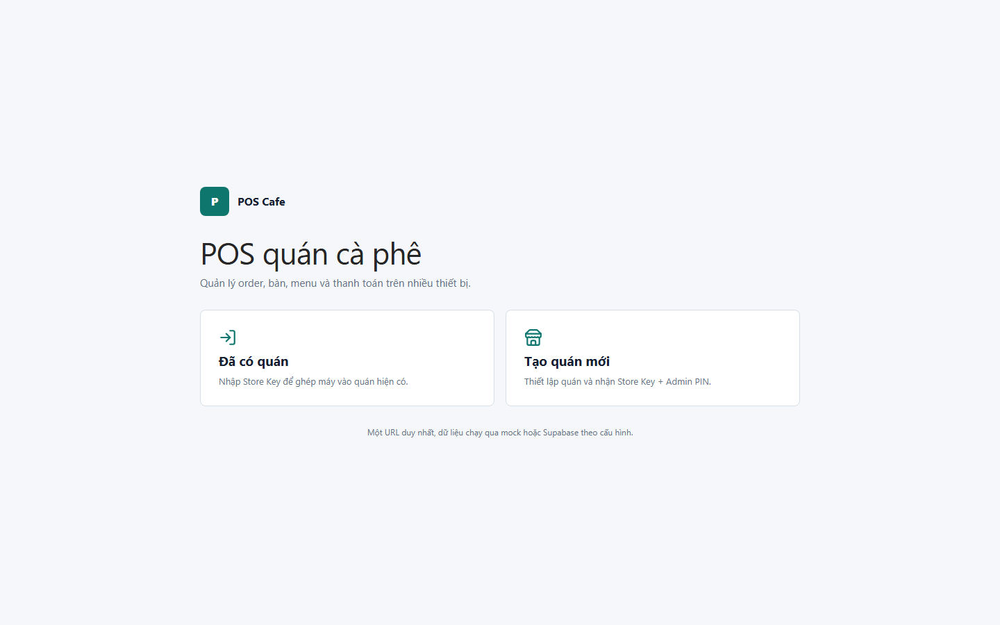

# 01 - Landing

- Verdict: High demo risk

## Layout Assessment

The two-card entry is understandable, but the page is too empty for a first impression. It feels like a developer start screen rather than a finished POS product. The product signal is small compared with the unused viewport.

## Visual Design Assessment

Clean but plain. The cards, icon treatment, and background do not create enough product confidence for a demo.

## UX / Workflow Assessment

The two choices are clear. The issue is not flow but presentation: the first screen should feel like a cafe POS entry point, not a config launcher.

## Copy Cleanup Notes

Remove "Một URL duy nhất, dữ liệu chạy qua mock hoặc Supabase theo cấu hình." It is internal implementation copy and was explicitly called out as AI/dev text.

## Button / Action Notes

The cards are large enough and easy to click. Labels are clear, but "Tạo quán mới" should be visually secondary if the normal workflow is pairing an existing store.

## Read-Only / Hidden-Field Notes

No read-only fields are needed here. Do not show data-mode or infrastructure information on this page.

## Issues By Severity

- P1: Internal mock/Supabase/config copy appears on the first screen.
- P1: First viewport is visually underpowered for a demo.
- P2: Brand/product presence is too small.

## Redesign Direction

Make this a compact branded access screen: logo/store identity, primary "Vào quán bằng Store Key", secondary "Tạo quán mới", and no implementation text. Add a stronger cafe/POS visual cue or product illustration only if it supports the workflow.

## Demo Risk

High. A reviewer can immediately infer the UI was generated or built around mock/Supabase toggles.
