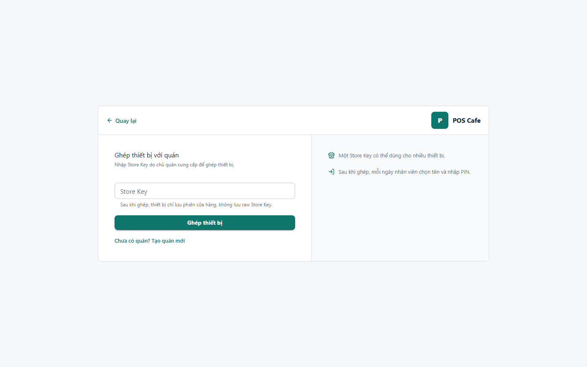

# 02 - Store Pairing

- Verdict: Needs polish

## Layout Assessment

The split card is understandable, but the right panel is sparse and does not justify half the card width. The flow should focus attention on the Store Key input and submit action.

## Visual Design Assessment

Neat but generic. The white card on gray background is acceptable, not memorable.

## UX / Workflow Assessment

The user can infer the next step. However, support/help information is too thin for a high-friction credential screen.

## Copy Cleanup Notes

"raw Store Key" is developer language. Rewrite as "Thiết bị chỉ lưu phiên đăng nhập của quán." Keep security reassurance but remove implementation phrasing.

## Button / Action Notes

"Ghép thiết bị" is clear and full width. The "Tạo quán mới" link is useful but could be a secondary button for visibility.

## Read-Only / Hidden-Field Notes

Do not show storage implementation details. If security is needed, keep it user-facing and brief.

## Issues By Severity

- P2: Right-side guidance is too empty.
- P2: "raw Store Key" sounds technical.
- P3: The back action is small compared with the form.

## Redesign Direction

Use a narrower centered form with a compact help block below it. Move secondary create-store action under the primary button with clearer visual hierarchy.

## Demo Risk

Moderate. It will not break the demo, but copy polish is visibly unfinished.
