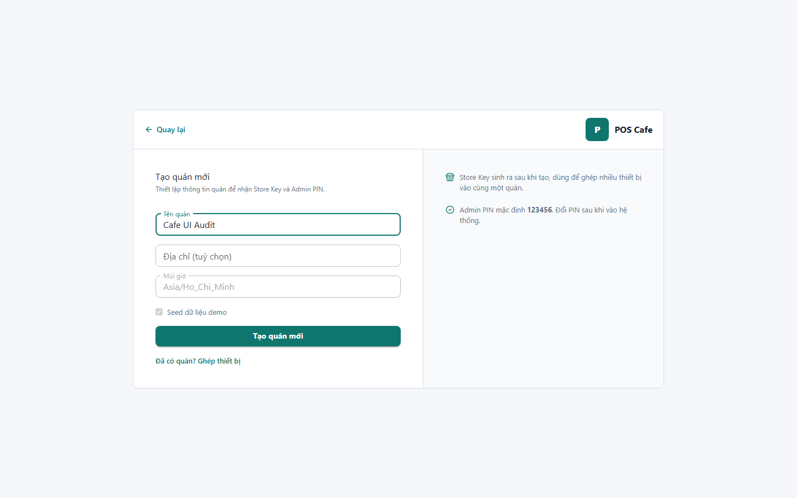

# 03 - Create Store Form

- Verdict: Needs polish

## Layout Assessment

The form is clear, but the screen still feels like setup scaffolding. The right column can be useful, but currently the page has too much empty card area for one text field.

## Visual Design Assessment

Consistent with pairing, but visually quiet. There is not enough hierarchy around the store identity being created.

## UX / Workflow Assessment

The create flow is understandable. The user may not know what happens after creation until the next screen.

## Copy Cleanup Notes

Use friendlier operational language: "Tên quán" instead of any system-oriented wording. Avoid mentioning Store Key mechanics before the result screen unless necessary.

## Button / Action Notes

Primary button is clear and correctly placed. It could include an icon only if consistent with other setup actions.

## Read-Only / Hidden-Field Notes

No read-only fields are necessary. Keep the page focused on one decision.

## Issues By Severity

- P2: Too much empty horizontal space for a single-field form.
- P2: Setup flow lacks a polished confirmation of what will be created.
- P3: Secondary guidance is visually weak.

## Redesign Direction

Collapse into a focused setup card with three steps: name quán, create access, continue to PIN. Keep supporting text concise.

## Demo Risk

Moderate. It is functional but not visually strong.
