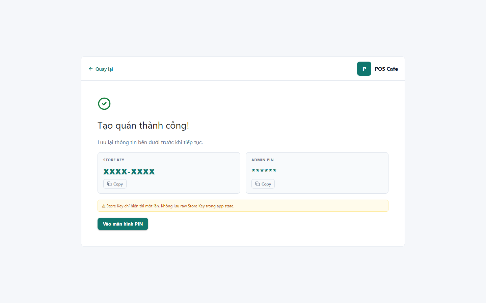

# 04 - Create Store Success

- Verdict: High demo risk

## Layout Assessment

The success card is orderly, but the screen is credential-heavy. It stops the flow and asks the presenter to explain security rather than showing product value.

## Visual Design Assessment

The sensitive values look like plain UI fields, not a carefully designed credential handoff.

## UX / Workflow Assessment

The user can continue to PIN, but the one-time key/PIN moment needs stronger affordances: copy, reveal, downloaded note, or clear "I saved this" confirmation.

## Copy Cleanup Notes

Avoid internal state wording. Keep the warning user-facing: "Lưu lại Store Key và Admin PIN. Bạn sẽ cần chúng để đăng nhập thiết bị khác."

## Button / Action Notes

"Tiếp tục đăng nhập" is clear. Consider a copy action for each credential and an explicit acknowledgement before continuing.

## Read-Only / Hidden-Field Notes

Credentials are read-only but sensitive. They should be treated as secrets, masked by default or shown in a controlled reveal block.

## Issues By Severity

- P1: Sensitive setup credentials dominate the screen.
- P1: Demo can accidentally expose Store Key/Admin PIN.
- P2: Success state feels more technical than product-like.

## Redesign Direction

Create a polished "Quán đã tạo" handoff with masked credentials, copy buttons, warning copy, and a single next action. For demo screenshots, seed harmless placeholder values only.

## Demo Risk

High. Even with masked audit screenshot, the real UI can show secrets during a live demo.
