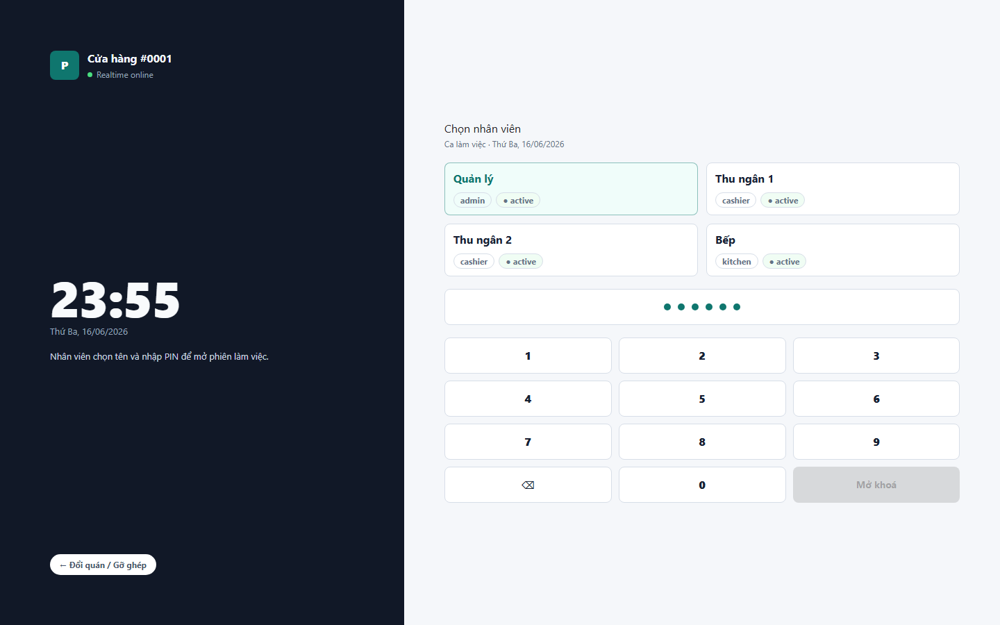

# 05 - Passcode

- Verdict: Demo-ready

## Layout Assessment

The employee selection plus PIN keypad is clear and appropriate for POS usage. It reads as an operational login screen.

## Visual Design Assessment

This is one of the cleaner screens. Spacing is calm and the selected employee state is readable.

## UX / Workflow Assessment

The next step is obvious: choose employee, enter PIN, unlock. This should demo well.

## Copy Cleanup Notes

No major dev-copy issue visible. Keep "online" only if it means something useful to operators.

## Button / Action Notes

Keypad targets are large enough. Unlock button is clear.

## Read-Only / Hidden-Field Notes

Role labels are useful. Avoid showing technical session details.

## Issues By Severity

- P2: The screen could benefit from stronger store identity.
- P3: "online" may be unnecessary if not actionable.

## Redesign Direction

Keep the structure. Add subtle store name/context and make online status less prominent unless it can change operator behavior.

## Demo Risk

Low. This screen is ready enough for demo.
