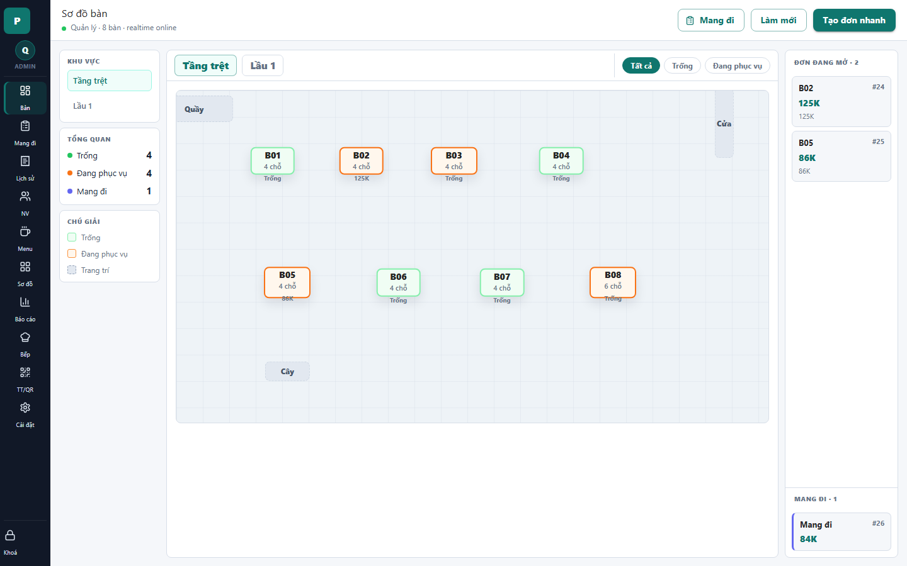

# 06 - POS Floor

- Verdict: Needs polish

## Layout Assessment

The core POS layout works: rail, area filters, floor canvas, and open order queue are all visible. The weakness is balance: the canvas is oversized and sparse, while the active order queue is narrow and visually secondary.

## Visual Design Assessment

Readable but not premium. The table nodes look clear, but the grid and large empty stage make the screen feel unfinished.

## UX / Workflow Assessment

Opening a table is straightforward. Open order cards are clickable, but they need more information density: table/order, elapsed time, item count, and payment status.

## Copy Cleanup Notes

"realtime online" is understandable to engineers but not necessary for cashiers. Replace with a compact sync indicator only when it matters.

## Button / Action Notes

"Mang đi", "Làm mới", and "Tạo đơn nhanh" are useful. The primary action hierarchy is good.

## Read-Only / Hidden-Field Notes

The legend is useful, but could be collapsed once users know the states. The left summary panel may be redundant with table colors.

## Issues By Severity

- P1: The first operational screen lacks visual polish for demo.
- P2: Open orders are under-emphasized.
- P2: Canvas has too much unused area.
- P3: Sync copy is too technical.

## Redesign Direction

Make floor more intentional: stronger table cards, richer occupied-state metadata, a denser right queue, and fewer boxed side panels. Keep the logical scale model but improve visual weight.

## Demo Risk

Moderate. It works, but reviewers may call it plain.
