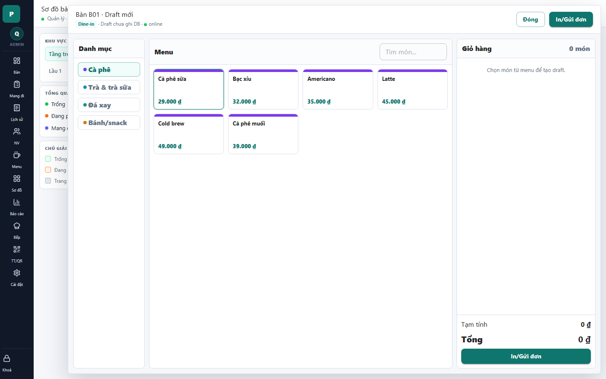

# 07 - Order Drawer: New Draft

- Verdict: Needs polish

## Layout Assessment

The category-menu-cart structure is familiar and usable. The empty cart column is too large and the menu cards are overly sparse for a POS order-taking workflow.

## Visual Design Assessment

Clean, but the large white zones make the drawer feel unfinished when the cart is empty.

## UX / Workflow Assessment

The cashier can add items quickly. Search is well placed. The empty cart message should be more compact and closer to the action area.

## Copy Cleanup Notes

"Draft chưa ghi DB" must be removed. It is direct internal database copy.

## Button / Action Notes

"In/Gửi đơn" is clear, but it appears both in header and footer across states; avoid duplicated CTAs unless the footer is sticky and visually distinct.

## Read-Only / Hidden-Field Notes

The draft/database state should be hidden. Cashiers only need to know whether the order is unsent or already sent.

## Issues By Severity

- P1: "DB" appears in user UI.
- P2: Cart empty state wastes the full right pane.
- P2: Menu cards could support faster scanning with item groups or denser layout.

## Redesign Direction

Rename status to "Chưa gửi bếp", shrink empty cart state, and make item cards denser with optional quick-add controls.

## Demo Risk

Moderate. The DB copy is the main visible problem.
