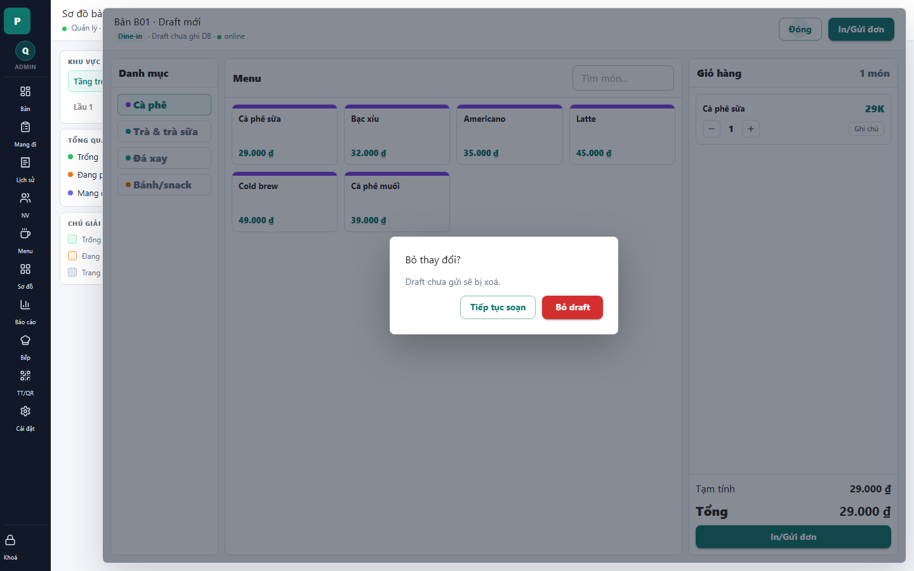

# 08 - Order Dirty Close Confirm

- Verdict: Needs polish

## Layout Assessment

The modal is centered and easy to parse. The dimmed background keeps context visible.

## Visual Design Assessment

Acceptable, but generic. It could use stronger warning hierarchy and less empty modal padding.

## UX / Workflow Assessment

The two options are understandable. The user is protected from accidental draft loss.

## Copy Cleanup Notes

"Draft" is a product/developer hybrid term. Use "đơn chưa gửi" or "món chưa lưu" instead.

## Button / Action Notes

"Tiếp tục soạn" and "Bỏ draft" are clear enough, but "Bỏ draft" should become "Bỏ đơn nháp" or "Bỏ món vừa chọn".

## Read-Only / Hidden-Field Notes

No read-only field issue.

## Issues By Severity

- P2: Draft terminology should be localized.
- P3: Modal visual treatment is plain.

## Redesign Direction

Keep behavior. Rewrite copy and make destructive action clearly secondary/danger with more explicit consequence.

## Demo Risk

Low to moderate. It is functionally safe, but copy needs cleanup.
