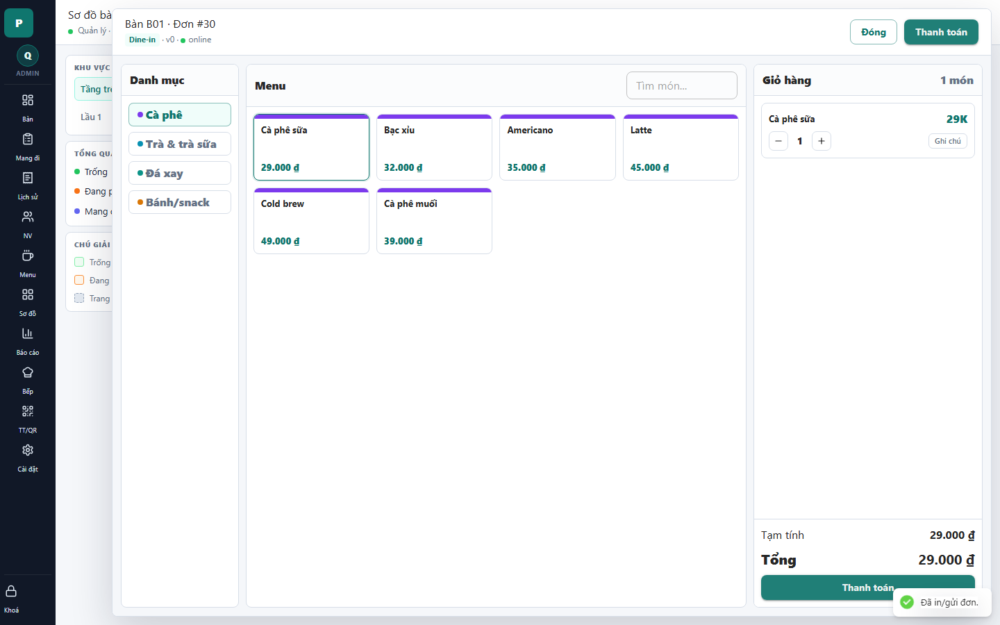

# 09 - Order Drawer: Existing Order

- Verdict: Needs polish

## Layout Assessment

The layout remains familiar after the order is created, and the cart panel now has enough content to be useful. The screen still has more whitespace than a fast cashier workflow needs.

## Visual Design Assessment

Readable but utilitarian. The selected item border and cart totals work, but the interface lacks a refined rhythm.

## UX / Workflow Assessment

Payment entry is discoverable through the primary button. Quantity controls and note button are clear enough.

## Copy Cleanup Notes

"v0" in the header is internal lock-version language. Replace with no version display or a user-facing "Đã đồng bộ".

## Button / Action Notes

"Thanh toán" is a strong CTA. The note button is understandable but small.

## Read-Only / Hidden-Field Notes

Hide lock/version details. Cashiers do not need to see concurrency metadata.

## Issues By Severity

- P1: Version marker is visible in cashier UI.
- P2: Cart detail pane has weak visual hierarchy.
- P3: Note action could be easier to scan.

## Redesign Direction

Keep the overall order structure, but remove technical state, reduce whitespace, and make cart rows look more transactional.

## Demo Risk

Moderate. The version text is the main demo concern.
