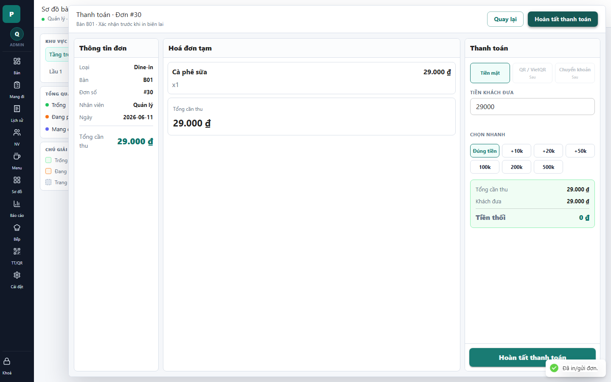

# 10 - Payment Drawer: Normal Cash

- Verdict: Needs polish

## Layout Assessment

The three-pane payment structure is sensible: order info, bill snapshot, payment controls. On a small order, the center pane becomes a large blank area.

## Visual Design Assessment

This is one of the stronger operational screens. The payment card, quick cash buttons, and change summary are visually clear.

## UX / Workflow Assessment

Cash payment flow is understandable and fast. Disabled QR/bank methods are visible, which can distract from the supported path.

## Copy Cleanup Notes

"QR / VietQR" and "Chuyển khoản" can remain if they are real roadmap items, but the "Sau" tags should be hidden for demo or presented as disabled without roadmap language.

## Button / Action Notes

The header and sticky footer both say "Hoàn tất thanh toán". Duplication is useful only if the footer stays visible while scrolling; otherwise keep one primary CTA.

## Read-Only / Hidden-Field Notes

Order number, employee, and business date are useful but could be less dominant than the total.

## Issues By Severity

- P2: Large blank center area for small bills.
- P2: Disabled future methods draw attention.
- P3: Duplicate primary CTA may feel heavy.

## Redesign Direction

Keep this flow. Tighten the bill snapshot, make total/received/change the visual hero, and hide unsupported payment methods unless they are demo-ready.

## Demo Risk

Moderate. Functionally strong, visually still a bit sparse.
