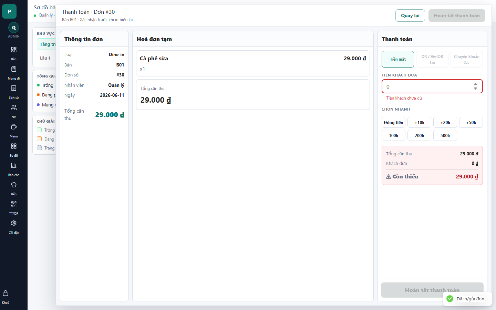

# 11 - Payment Drawer: Insufficient Cash

- Verdict: Demo-ready

## Layout Assessment

The same payment layout holds up well in an error state. The insufficient amount is visible in the right pane.

## Visual Design Assessment

The red/error treatment is clear enough without overwhelming the screen.

## UX / Workflow Assessment

The user can understand that cash received is not enough and correct the input. This is a good demo state.

## Copy Cleanup Notes

Keep copy short: "Tiền khách chưa đủ" works. Avoid adding technical validation text.

## Button / Action Notes

The primary completion button should remain disabled or clearly error-colored until the amount is valid.

## Read-Only / Hidden-Field Notes

No extra read-only information is needed for this state.

## Issues By Severity

- P3: Consider making the missing amount more prominent than the helper text.
- P3: Disabled/future payment methods still distract.

## Redesign Direction

Keep behavior. Slightly strengthen the "Còn thiếu" card and reduce surrounding blank space.

## Demo Risk

Low. This state demonstrates validation well.
