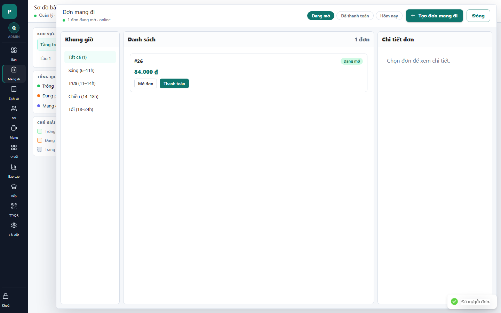

# 12 - Takeaway Drawer

- Verdict: Needs polish

## Layout Assessment

The screen has the right idea: time filters, order list, detail pane. With one order, the huge empty list/detail area feels weak.

## Visual Design Assessment

Clean but too plain. The takeaway order card is under-designed for an active queue.

## UX / Workflow Assessment

The user can create, open, or pay a takeaway order. The first order should be selected automatically so the detail pane does not look empty.

## Copy Cleanup Notes

"online" can be toned down or hidden. The rest is acceptable.

## Button / Action Notes

"Tạo đơn mang đi" is clear. "Mở đơn" and "Thanh toán" on the row are useful, but the row itself should communicate status and next action more strongly.

## Read-Only / Hidden-Field Notes

Time buckets are useful if they affect operations. If not, collapse them behind a filter.

## Issues By Severity

- P1: Detail pane is empty even though an order is available.
- P2: Large blank list area makes the screen feel unfinished.
- P2: Order card lacks item/time/customer context.

## Redesign Direction

Auto-select the first order, enrich cards with items/created time, and make the detail pane the operational focus.

## Demo Risk

Moderate. It can be demoed, but it looks thin.
