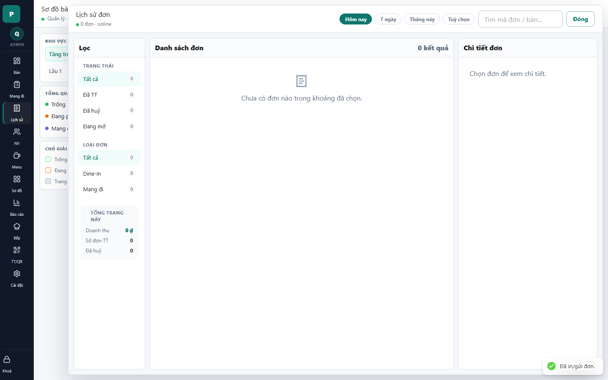

# 13 - Order History Drawer

- Verdict: Needs polish

## Layout Assessment

Filters, result list, and detail pane are logically placed. The empty result state occupies a very large area and makes the screen feel inactive.

## Visual Design Assessment

The screen is neat but low-energy. The summary card in the filter pane is useful but visually small.

## UX / Workflow Assessment

The filter workflow is understandable. For demo, this screen needs meaningful historical data or a richer empty state.

## Copy Cleanup Notes

No major dev-copy visible. Keep "Đã TT" only if this abbreviation is known to target users.

## Button / Action Notes

Date-range buttons are understandable. Search input is correctly placed.

## Read-Only / Hidden-Field Notes

Totals are useful. Empty details pane should be hidden or replaced with guidance when there is no selected order.

## Issues By Severity

- P1: Empty demo data makes the screen look unfinished.
- P2: Abbreviation "Đã TT" may be unclear.
- P2: Detail pane is empty by default.

## Redesign Direction

Seed a few paid/cancelled sample orders for demo. Auto-select first result and make filter summary more actionable.

## Demo Risk

Moderate. Empty history can be acceptable only if explained, but it will not impress.
