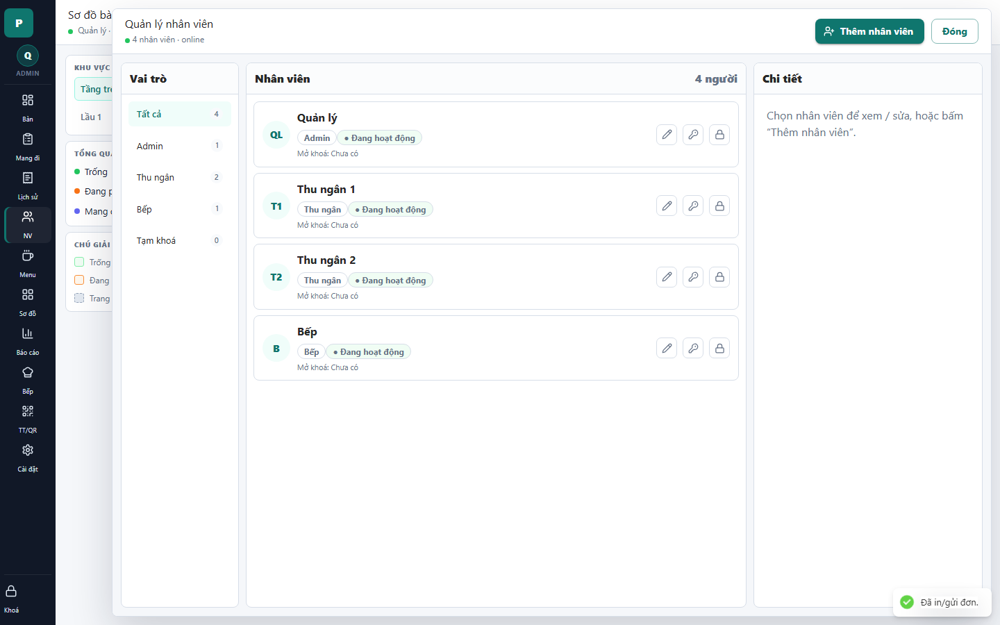

# 14 - Employees Drawer

- Verdict: Needs polish

## Layout Assessment

The role filter and employee list are clear. The right detail pane is empty even though employees are loaded, which weakens the screen.

## Visual Design Assessment

Employee rows are readable. Icon-only row actions look tidy but are not self-explanatory.

## UX / Workflow Assessment

Adding an employee is obvious. Editing/keys/lock actions require icon interpretation and need tooltips or labels.

## Copy Cleanup Notes

"Mở khóa: Chưa có" may be internal unless operators understand the lock workflow. Explain it better or hide until relevant.

## Button / Action Notes

"Thêm nhân viên" is a good primary CTA. Icon buttons need accessible names/tooltips and maybe a visible overflow menu.

## Read-Only / Hidden-Field Notes

Role and status are useful. Lock state should be shown only if it affects an action.

## Issues By Severity

- P1: Detail pane is empty despite selected-capable data.
- P2: Icon-only actions are ambiguous.
- P2: Lock-state copy may be unnecessary.

## Redesign Direction

Auto-select the first employee. Move row actions into a clear menu or add tooltips. Only show lock state when locked or actionable.

## Demo Risk

Moderate. It works, but the empty right pane and icon buttons invite questions.
