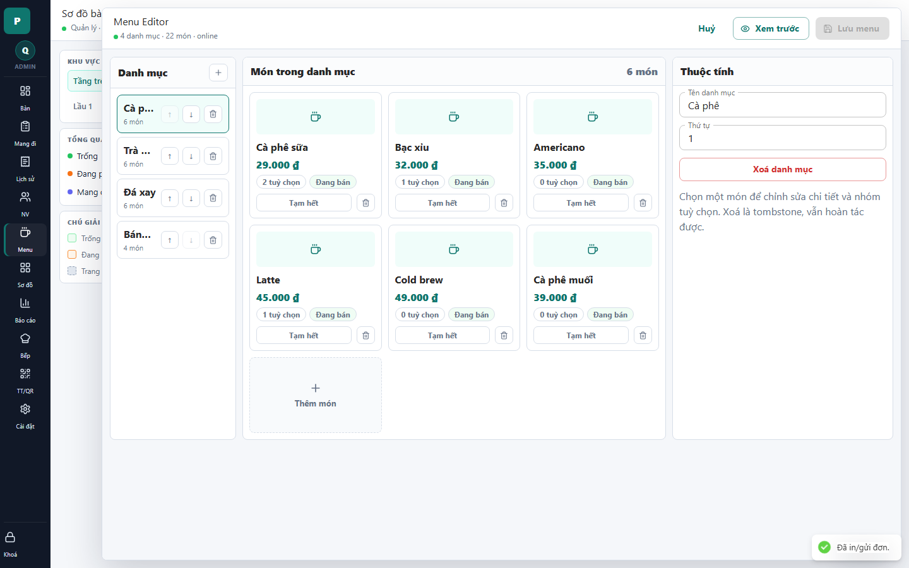

# 15 - Menu Editor Drawer

- Verdict: High demo risk

## Layout Assessment

The editor is functional but too busy. Category list, card grid, and properties panel all compete for attention, and the right panel initially explains deletion instead of helping edit a selected item.

## Visual Design Assessment

Repeated placeholder image blocks make the menu look unfinished. The dense cards and many small icon buttons feel like an internal admin tool.

## UX / Workflow Assessment

Basic editing is possible, but the workflow is not obvious enough for a polished demo. The user has to infer what to select and where details appear.

## Copy Cleanup Notes

"Menu Editor" should be Vietnamese. Remove "tombstone" from visible copy.

## Button / Action Notes

Save and preview actions are clear. Small delete/reorder buttons need tooltips and should not dominate every row/card.

## Read-Only / Hidden-Field Notes

Category order is editable, but it may not need to be visible as a plain field unless the user is in reorder mode.

## Issues By Severity

- P1: "tombstone" appears in user-facing copy.
- P1: Placeholder item imagery looks unfinished.
- P2: Too many always-visible admin controls.
- P2: English title breaks polish.

## Redesign Direction

Split into modes: category management, item list editing, item detail. Use table/list density for admin tasks and reserve cards for preview.

## Demo Risk

High. This screen will likely be challenged as ugly or admin-heavy.
