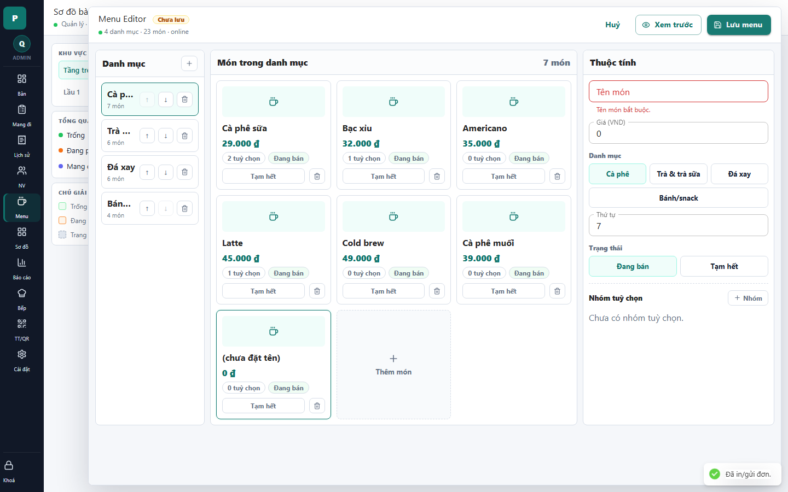

# 16 - Menu Editor: Dirty New Item

- Verdict: High demo risk

## Layout Assessment

The dirty state is visible, but adding a new item creates a large incomplete card and a validation-heavy right panel. This is accurate but visually rough.

## Visual Design Assessment

The red validation field is clear. The unfinished "(chưa đặt tên)" card with placeholder art looks unpolished.

## UX / Workflow Assessment

The user can tell the item needs a name. However, the new item should probably open as a focused form, not appear as another incomplete card in the grid.

## Copy Cleanup Notes

"Menu Editor" remains English. Avoid showing default zero price as if it were a valid product card.

## Button / Action Notes

Save disabled state is good. "Tạm hết" on a not-yet-created item is not useful.

## Read-Only / Hidden-Field Notes

Order/status/category controls are editable, but not all need to appear before the required name/price are valid.

## Issues By Severity

- P1: New-item state looks broken in demo.
- P2: Too many controls appear before required fields are valid.
- P2: Product card preview for incomplete item is distracting.

## Redesign Direction

Use a dedicated "Thêm món" form or side sheet with required fields first. Only create a menu card preview after name and price are valid.

## Demo Risk

High. This is the kind of state that makes an app look half-built.
