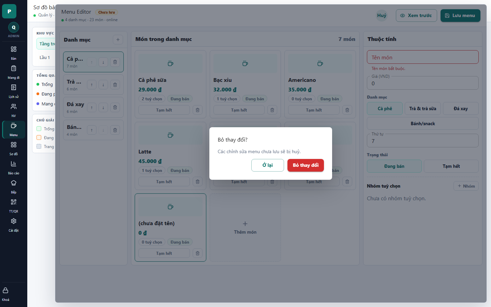

# 17 - Menu Editor Dirty Confirm

- Verdict: Needs polish

## Layout Assessment

The confirm dialog is centered and readable. It correctly blocks accidental loss.

## Visual Design Assessment

Modal styling is fine, but generic. The dimmed busy editor background adds visual noise.

## UX / Workflow Assessment

The options are clear. "Ở lại" and "Bỏ thay đổi" are appropriate.

## Copy Cleanup Notes

The message is acceptable. Keep this Vietnamese phrasing and avoid internal terms.

## Button / Action Notes

Action hierarchy is good: safe action outlined, destructive action red.

## Read-Only / Hidden-Field Notes

No read-only issue.

## Issues By Severity

- P3: Dialog could mention what type of change will be discarded.
- P3: Background editor clutter makes the modal feel heavy.

## Redesign Direction

Keep behavior. Consider adding a short summary such as "1 món mới chưa lưu" when available.

## Demo Risk

Low to moderate. The dialog is acceptable, but the underlying editor remains high risk.
