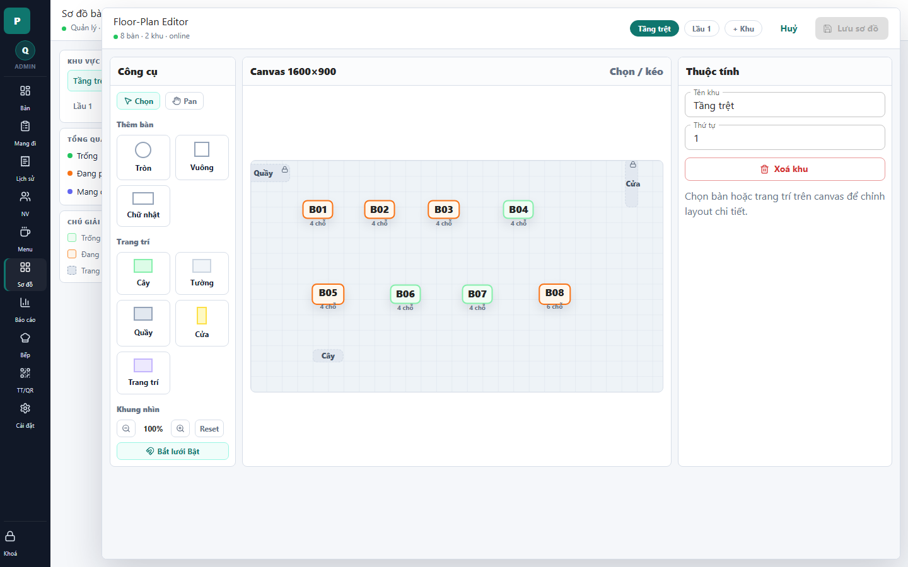

# 18 - Floor Editor Drawer

- Verdict: High demo risk

## Layout Assessment

The editor has the right three zones: tools, canvas, properties. The problem is that it exposes tool language and raw canvas concepts too prominently for a polished admin screen.

## Visual Design Assessment

The canvas is clear, but the UI looks like a design/debug tool. Tool buttons, grid, and properties panel need stronger visual refinement.

## UX / Workflow Assessment

Selecting and editing tables is possible, but the user has to understand select/pan, grid, zoom, and object tools all at once.

## Copy Cleanup Notes

"Floor-Plan Editor", "Canvas 1600x900", "Pan", and "Reset" should be translated or hidden behind advanced controls. The logical stage dimensions should not be user-facing.

## Button / Action Notes

Save and cancel actions are clear. Add-table and decor buttons are easy to see, but the tool names need localization.

## Read-Only / Hidden-Field Notes

Logical canvas size is not actionable for normal admins and should not be displayed.

## Issues By Severity

- P1: Technical canvas dimensions are visible.
- P1: English/tooling terms make the screen feel unfinished.
- P2: Too many controls visible at once.
- P2: The properties panel begins on area fields instead of guiding table editing.

## Redesign Direction

Reframe as "Sơ đồ bàn" with modes: Chỉnh bàn, Trang trí, Khu vực. Hide canvas dimensions and advanced pan/zoom behind small controls.

## Demo Risk

High. This screen will draw criticism if shown as a finished admin feature.
