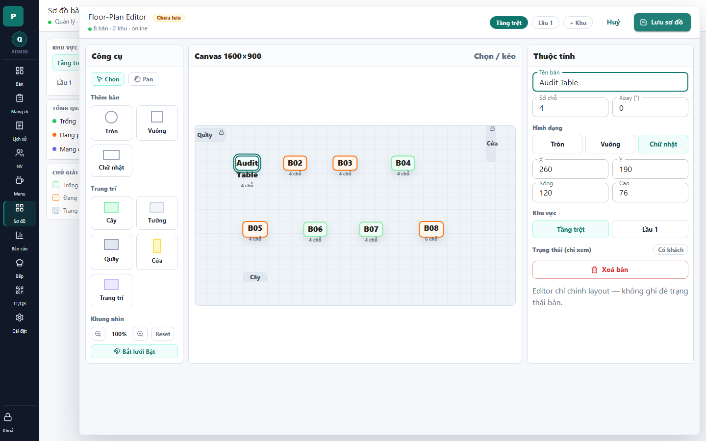

# 19 - Floor Editor: Dirty Table Edit

- Verdict: High demo risk

## Layout Assessment

The dirty badge and selected table state are visible. The right properties panel is useful, but it is dense and tool-like.

## Visual Design Assessment

The selected object feedback is clear. The editor still feels like a low-level layout canvas rather than a polished restaurant setup screen.

## UX / Workflow Assessment

Editing a table name is understandable. More advanced fields should be grouped so common edits do not compete with layout controls.

## Copy Cleanup Notes

Keep "Chưa lưu". Remove or translate English/editor terms elsewhere in the screen.

## Button / Action Notes

Save button state is good. "Hủy" is clear. Small tool controls still need stronger hierarchy.

## Read-Only / Hidden-Field Notes

If position/size/rotation fields are shown in this state, keep them collapsed under "Nâng cao" unless the admin is actively moving/resizing objects.

## Issues By Severity

- P1: Editing state still exposes a technical editor feel.
- P2: Common and advanced fields are not clearly separated.
- P2: Dirty state is visible but not tied to a specific changed object.

## Redesign Direction

Use a simpler table edit panel: name, area, seats, shape first; position/rotation/size under advanced. Show changed item summary near save.

## Demo Risk

High. The feature works, but presentation needs product polish.
