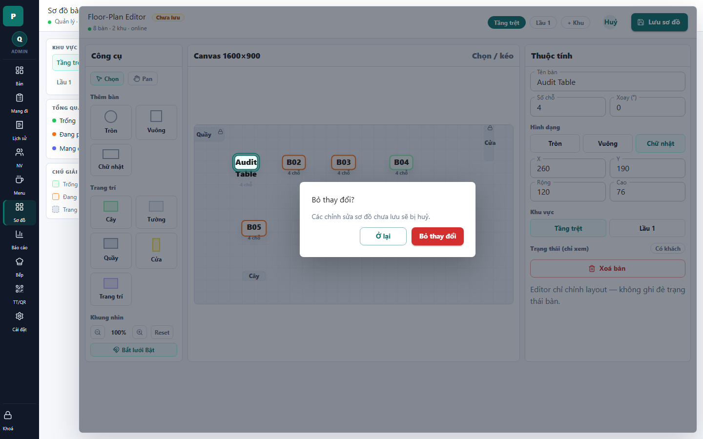

# 20 - Floor Editor Dirty Confirm

- Verdict: Needs polish

## Layout Assessment

The confirmation modal is readable and protects against accidental loss.

## Visual Design Assessment

The modal is consistent with other confirm dialogs. It does not look broken, just generic.

## UX / Workflow Assessment

The user understands that unsaved floor edits will be discarded.

## Copy Cleanup Notes

Copy is acceptable if fully localized. Avoid using "layout" if the target user does not think in layout terms.

## Button / Action Notes

"Ở lại" and "Bỏ thay đổi" are clear and correctly prioritized.

## Read-Only / Hidden-Field Notes

No read-only issue.

## Issues By Severity

- P3: Could mention the changed object count.
- P3: Generic modal styling does not add product quality.

## Redesign Direction

Keep behavior. Add a short change summary when available: "1 bàn đã đổi tên".

## Demo Risk

Low to moderate. The modal is fine; the editor behind it is the risky part.
