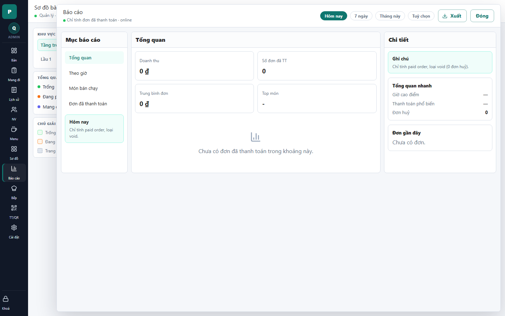

# 21 - Report Drawer

- Verdict: High demo risk

## Layout Assessment

The report structure is reasonable, but the screen is empty and static. Large zero metrics plus a blank chart area make it feel unfinished.

## Visual Design Assessment

Clean but weak. The report needs stronger data visualization and hierarchy.

## UX / Workflow Assessment

Filters are visible and understandable. The user gets no immediate business insight because demo data is empty.

## Copy Cleanup Notes

"paid order" and "void" are developer/accounting mix. Use Vietnamese operational terms: "đơn đã thanh toán" and "đơn hủy".

## Button / Action Notes

Date range controls and export button are useful. Export is a strong action but not useful when the report is empty.

## Read-Only / Hidden-Field Notes

The note card is useful only if written for store owners. Avoid exposing implementation rules in prominent note blocks.

## Issues By Severity

- P1: Empty report data is a demo risk.
- P1: English/internal terms appear in report note.
- P2: Chart area lacks a polished empty state.
- P2: Detail pane repeats low-value information.

## Redesign Direction

Seed meaningful paid orders for demo. If empty, show a designed empty state with next action and hide advanced detail cards.

## Demo Risk

High. A business report with all zeros can make the app look incomplete.
