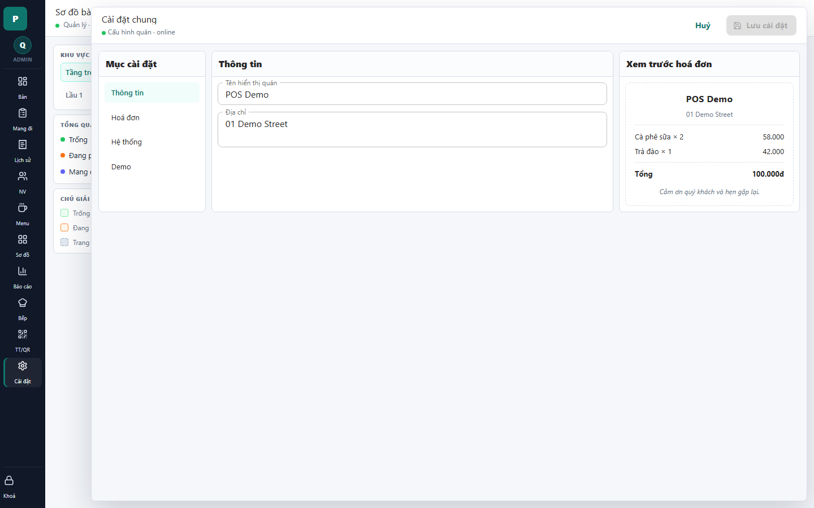

# 22 - General Settings Drawer

- Verdict: Needs polish

## Layout Assessment

The settings layout is understandable. The form and receipt preview are useful, but the middle pane has too much empty space for two fields.

## Visual Design Assessment

Simple and clean. It is not ugly, but it feels like a generic settings page.

## UX / Workflow Assessment

Editing store name/address is straightforward. The receipt preview is helpful and belongs here.

## Copy Cleanup Notes

The "Demo" section should be hidden from normal settings or renamed/admin-scoped. Avoid "Demo" as a production-facing settings category.

## Button / Action Notes

Save state is clear. Cancel is visible. No major button issue on the info tab.

## Read-Only / Hidden-Field Notes

System fields such as timezone/currency should be shown only if they are actionable or explain billing behavior. Otherwise hide or move to an advanced/system section.

## Issues By Severity

- P2: "Demo" tab is exposed in normal settings.
- P2: Large empty form area.
- P3: Receipt preview is useful but visually isolated.

## Redesign Direction

Keep receipt preview. Make settings denser, group advanced fields, and move demo reset tools behind an admin-only maintenance area.

## Demo Risk

Moderate. It is acceptable, but visible demo tooling reduces polish.
