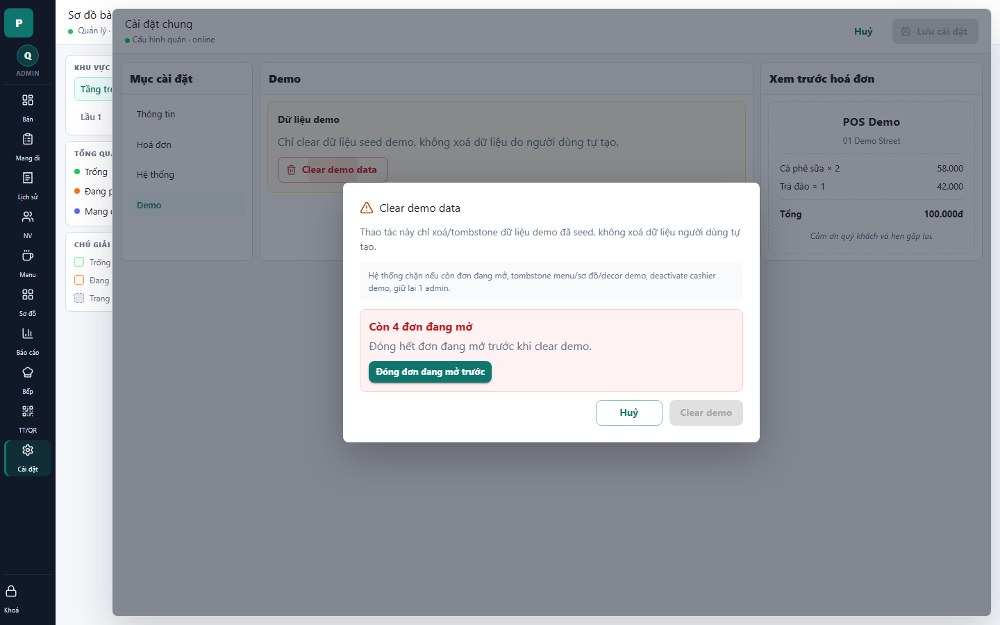

# 23 - Clear Demo Dialog: Blocked

- Verdict: High demo risk

## Layout Assessment

The blocked state is clear and the modal is centered well. The problem is not layout; it is product framing.

## Visual Design Assessment

The warning card is readable, but the dialog looks like an internal maintenance tool exposed to users.

## UX / Workflow Assessment

Blocking while open orders exist is correct. The user can understand why the destructive action is disabled.

## Copy Cleanup Notes

This screen contains multiple internal terms: "Clear demo data", "tombstone", "seed", "deactivate cashier", and "admin". These should not appear in a user-facing demo.

## Button / Action Notes

"Đóng đơn đang mở trước" is clear. "Clear demo" should be hidden unless the app is explicitly in demo maintenance mode.

## Read-Only / Hidden-Field Notes

The system cleanup list is internal. Show only the consequence relevant to the admin.

## Issues By Severity

- P0: Internal maintenance vocabulary is visible.
- P1: Destructive demo tooling is inside normal settings.
- P2: Mixed English/Vietnamese reduces polish.

## Redesign Direction

Move this behind an admin-only "Dữ liệu mẫu" maintenance page or remove from demo. Rewrite as "Đặt lại dữ liệu mẫu" with plain consequences.

## Demo Risk

Very high. Do not show this in a defense/demo unless specifically explaining internal admin tools.
