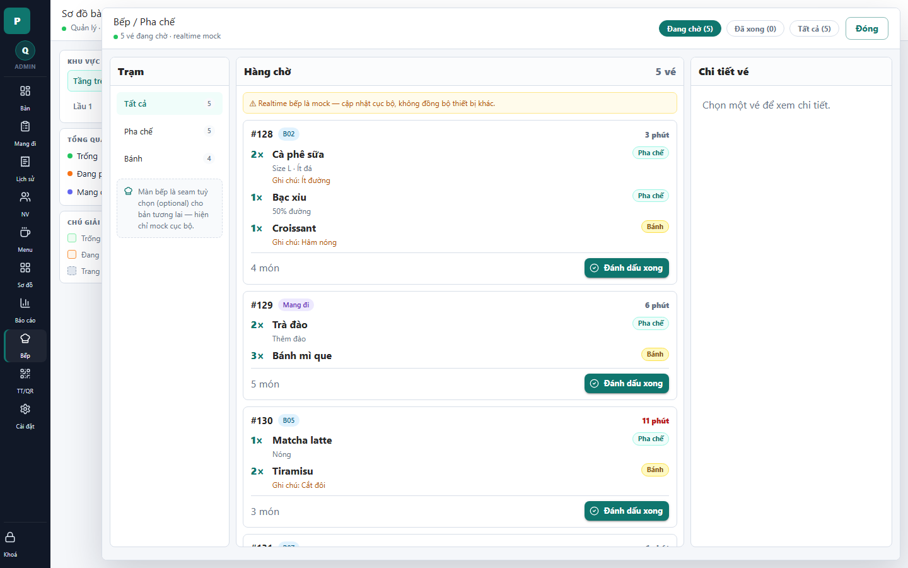

# 24 - Kitchen Queue Drawer

- Verdict: High demo risk

## Layout Assessment

The kitchen queue itself is useful and information-rich. The station filter and tickets are operationally sensible.

## Visual Design Assessment

Ticket cards are clearer than many other admin screens. The yellow warning and side note make the screen look like a mock/test page.

## UX / Workflow Assessment

Kitchen staff can understand what to prepare and mark done. The detail pane is empty by default even though tickets exist; first ticket should be selected.

## Copy Cleanup Notes

Remove "realtime mock", "mock cục bộ", and "cập nhật cục bộ". The note about station being optional also sounds like implementation explanation.

## Button / Action Notes

"Đánh dấu xong" is clear and reachable. Filter chips are useful.

## Read-Only / Hidden-Field Notes

Do not show implementation limitations. If kitchen sync is not live, hide the screen from demo or label it as a prototype outside production UI.

## Issues By Severity

- P0: "realtime mock" is visible in a demo-critical operations screen.
- P1: First ticket is not auto-selected.
- P2: Warning banner undermines confidence.

## Redesign Direction

Remove mock warning, auto-select the first ticket, and turn station filtering into a real kitchen workflow with clear status.

## Demo Risk

Very high if shown with the current copy. The functionality is promising, but copy makes it look fake.
