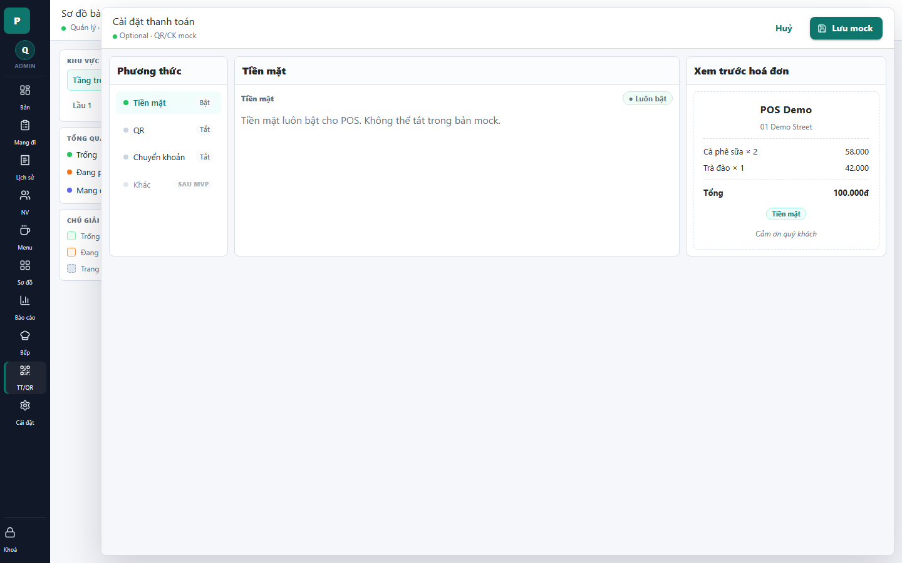

# 25 - Payment Settings Drawer

- Verdict: High demo risk

## Layout Assessment

The settings structure is clear, but most of the screen is blank because only cash has content. The preview card helps, but the center pane is too empty.

## Visual Design Assessment

Clean but unfinished. Disabled payment methods and badges look like roadmap placeholders.

## UX / Workflow Assessment

The user can see cash is always enabled, but there is very little useful action to take. QR/bank options look present but unavailable.

## Copy Cleanup Notes

Remove "Optional · QR/CK mock", "Lưu mock", "bản mock", and "SAU MVP". These are direct demo blockers.

## Button / Action Notes

"Lưu mock" is not acceptable for demo. If there is nothing to save for cash, the save button should be hidden or disabled with production copy.

## Read-Only / Hidden-Field Notes

"Tiền mặt luôn bật" is useful, but "không thể tắt trong bản mock" should never be shown to users.

## Issues By Severity

- P0: Mock/MVP language is visible in header, button, and body.
- P1: Disabled methods look like unfinished features.
- P2: Large empty content area.

## Redesign Direction

For demo, either hide Payment Settings until QR/bank are real, or present a polished read-only "Phương thức thanh toán" page without mock/MVP wording.

## Demo Risk

Very high. This screen should not be shown in its current copy state.
