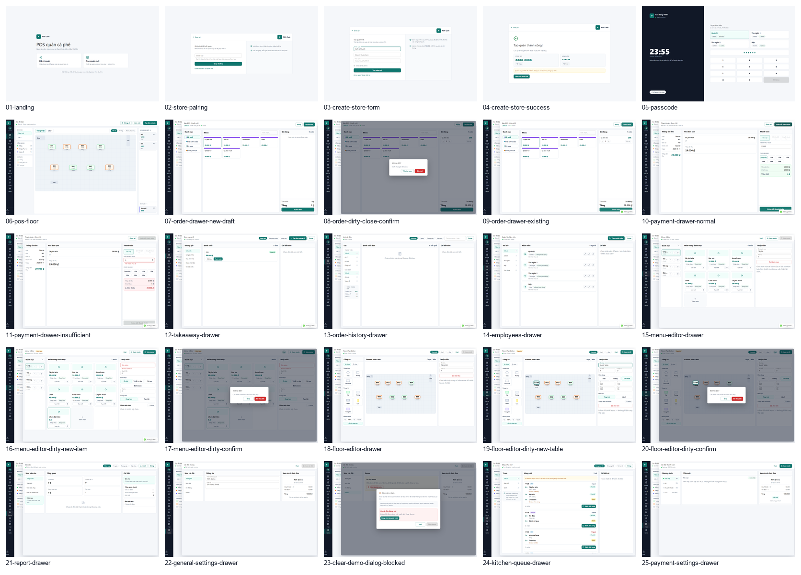

# Desktop UI/UX Audit - 2026-06-16

Scope: local mock mode, desktop viewport 1440x900. This audit is visual/UX only; no UI implementation is included.

## Overall UI Verdict

The app is functionally coherent and the POS core can be demonstrated, but the visual system is not yet demo-polished. The strongest screens are the passcode, payment flow, and basic floor operation. The weakest screens are the landing/preauth copy, Menu Editor, Floor Editor, Report, Kitchen, Payment Settings, and Clear Demo dialog because they expose internal implementation language or look like admin/debug tooling rather than a finished cafe POS product.

Overall verdict: Needs polish, with several High demo risk screens.

## Top 10 Layout / UX Problems

1. The main POS floor is usable but too spread out; the center canvas feels empty and the right order queue is visually secondary despite being operationally important.
2. Many drawers reuse the same three-pane admin layout even when the workflow needs a different hierarchy, making the product feel like panels stitched together.
3. Detail panes are often empty until the user selects an item; for demo, first item selection should be automatic on list screens.
4. Menu and Floor editors expose too many controls at once and do not distinguish everyday admin actions from advanced layout tools.
5. Payment has a good flow, but duplicated completion buttons and a large blank bill area reduce confidence on small orders.
6. Report screen shows zero data and a large blank chart area, which makes the product look unfinished during demo.
7. Takeaway and History screens have correct structure but too much unused space when the result set is small.
8. Settings and Payment Settings present read-only/internal configuration too prominently.
9. Confirmation dialogs are clear enough, but several use developer words such as draft, tombstone, mock, and seed.
10. Rail navigation is compact and efficient, but some labels are cryptic for first-time viewers: NV, TT/QR, and the lock action need stronger context.

## Top 10 Visual Polish Problems

1. Excessive pale cards and bordered panes make the interface feel flat and repetitive.
2. Large empty white panels appear across Payment, Takeaway, History, Report, Settings, and Payment Settings.
3. The palette leans heavily on teal plus low-contrast blue-gray, with little hierarchy beyond button color.
4. Typography is serviceable but lacks a crisp product hierarchy; headings inside panes compete with page titles.
5. Placeholder icon blocks in Menu Editor look repetitive and demo-unready.
6. Floor tables are clear but too toy-like; the canvas grid dominates without adding enough spatial richness.
7. Disabled/future features look like unfinished work instead of intentionally unavailable product scope.
8. Icon-only buttons in Employees and Menu Editor are small and unclear without tooltips or labels.
9. Empty states are often sparse text in a huge area, not designed moments.
10. English/Vietnamese mixing in admin titles reduces polish: Menu Editor, Floor-Plan Editor, Clear demo data.

## Top Copy Cleanup Issues

Remove or rewrite these classes of text before demo:

1. "Một URL duy nhất, dữ liệu chạy qua mock hoặc Supabase theo cấu hình."
2. "mock", "bản mock", "realtime mock", "Lưu mock".
3. "Supabase", "theo cấu hình", "config".
4. "raw Store Key".
5. "Draft chưa ghi DB".
6. "tombstone", "seed", "deactivate cashier".
7. "Sau MVP".
8. "paid order", "void".
9. "Canvas 1600x900".
10. Mixed English screen titles: Menu Editor, Floor-Plan Editor, Clear demo data.

## Screens Most Likely To Lose Demo Points

1. `01-landing` - internal data-mode copy is visible on the first impression.
2. `23-clear-demo-dialog-blocked` - exposes seed/tombstone/deactivate language.
3. `24-kitchen-queue-drawer` - visible "realtime mock" warning.
4. `25-payment-settings-drawer` - "QR/CK mock", "Lưu mock", and "Sau MVP" are direct demo risks.
5. `18-floor-editor-drawer` - technical canvas language and tool-heavy layout.
6. `15-menu-editor-drawer` - dense admin cards and "tombstone" copy.
7. `21-report-drawer` - empty report state makes the product look data-poor.
8. `04-create-store-success` - credential handling is correct in spirit but too sensitive-looking for a casual demo.

## Recommended Fix Order

1. Remove all dev/AI/internal copy from user-visible UI.
2. Polish the demo-critical journey: landing -> store pairing/passcode -> floor -> order -> payment.
3. Hide or reframe unfinished payment/kitchen functionality instead of showing mock/MVP labels.
4. Redesign Menu Editor and Floor Editor as admin tools with clearer modes and less simultaneous chrome.
5. Seed meaningful report/history data for demo or design stronger empty states.
6. Make list/detail drawers auto-select a sensible first record.
7. Review all read-only fields and hide anything that does not affect a cashier/admin decision.
8. Improve visual hierarchy: fewer bordered panels, stronger page headers, denser data where useful.
9. Add tooltips or text labels for icon-only admin actions.
10. Run a separate mobile/responsive audit after desktop polish.

## Captured Screens

| File | Verdict |
| --- | --- |
| [01-landing.md](01-landing.md) | High demo risk |
| [02-store-pairing.md](02-store-pairing.md) | Needs polish |
| [03-create-store-form.md](03-create-store-form.md) | Needs polish |
| [04-create-store-success.md](04-create-store-success.md) | High demo risk |
| [05-passcode.md](05-passcode.md) | Demo-ready |
| [06-pos-floor.md](06-pos-floor.md) | Needs polish |
| [07-order-drawer-new-draft.md](07-order-drawer-new-draft.md) | Needs polish |
| [08-order-dirty-close-confirm.md](08-order-dirty-close-confirm.md) | Needs polish |
| [09-order-drawer-existing.md](09-order-drawer-existing.md) | Needs polish |
| [10-payment-drawer-normal.md](10-payment-drawer-normal.md) | Needs polish |
| [11-payment-drawer-insufficient.md](11-payment-drawer-insufficient.md) | Demo-ready |
| [12-takeaway-drawer.md](12-takeaway-drawer.md) | Needs polish |
| [13-order-history-drawer.md](13-order-history-drawer.md) | Needs polish |
| [14-employees-drawer.md](14-employees-drawer.md) | Needs polish |
| [15-menu-editor-drawer.md](15-menu-editor-drawer.md) | High demo risk |
| [16-menu-editor-dirty-new-item.md](16-menu-editor-dirty-new-item.md) | High demo risk |
| [17-menu-editor-dirty-confirm.md](17-menu-editor-dirty-confirm.md) | Needs polish |
| [18-floor-editor-drawer.md](18-floor-editor-drawer.md) | High demo risk |
| [19-floor-editor-dirty-new-table.md](19-floor-editor-dirty-new-table.md) | High demo risk |
| [20-floor-editor-dirty-confirm.md](20-floor-editor-dirty-confirm.md) | Needs polish |
| [21-report-drawer.md](21-report-drawer.md) | High demo risk |
| [22-general-settings-drawer.md](22-general-settings-drawer.md) | Needs polish |
| [23-clear-demo-dialog-blocked.md](23-clear-demo-dialog-blocked.md) | High demo risk |
| [24-kitchen-queue-drawer.md](24-kitchen-queue-drawer.md) | High demo risk |
| [25-payment-settings-drawer.md](25-payment-settings-drawer.md) | High demo risk |
