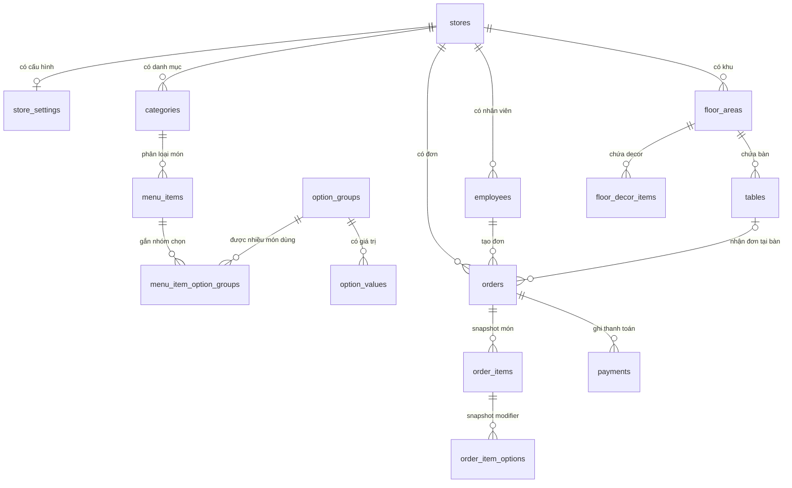

# Data Model

Cập nhật 2026-09-10 theo `main@3ada48c` đã push và nghiệm thu. Phạm vi/SHA/bằng chứng ở [phase 27](implementation-log/phase-27-idempotent-write-operations.md); chưa triển khai migration lên môi trường thật.

Data model dùng PostgreSQL/Supabase với **15 bảng nghiệp vụ chính**, thiết kế theo store-scoped multi-tenant: hầu hết bảng nghiệp vụ có `store_id`, UUID primary key, `created_at`, `updated_at`, và một số bảng editor có `deleted_at` để xóa mềm.

> **Quy tắc dùng cho báo cáo:** file này mô tả trạng thái dữ liệu cuối cùng. Tên migration, tên file SQL và symbol code chỉ là nguồn kiểm chứng nội bộ, không đưa vào báo cáo. Báo cáo tập trung vào ERD, bảng, trường, kiểu dữ liệu, PK/FK, quan hệ, constraint và quy tắc nghiệp vụ.

## ERD Rút Gọn

## Quan Hệ Và Ràng Buộc Chính

- Mỗi bảng nghiệp vụ con mang `store_id`; RLS dùng store Auth user để cô lập tenant.
- `store_settings.store_id` là PK/FK nên mỗi store có tối đa một settings row; create-store flow luôn tạo row này, nhưng schema riêng lẻ vẫn cho phép store có 0 settings.
- `menu_items.category_id` thuộc cùng store; modifier dùng bảng nối nhiều-nhiều `menu_item_option_groups`.
- `tables` và `floor_decor_items` thuộc một `floor_area`; order dine-in có `table_id`, takeaway để `null`.
- `order_items`/`order_item_options` giữ snapshot cả khi đơn còn `open`: retained giữ giá/options, chỉ phần mới lấy giá hiện hành. Đơn `paid`/`void` và receipt giữ lịch sử đã ghi — xem [limitations.md](limitations.md#giá-và-ghi-nhận-doanh-thu) và `015_write_business_helpers.sql`.
- `order_no` unique theo `(store_id, business_date, order_no)`; `lock_version` bảo vệ update cạnh tranh.
- App/RPC hiện tạo tối đa một payment cho một order paid, nhưng schema **không có unique constraint** trên `payments.order_id`; đây là invariant nghiệp vụ, không phải ràng buộc DB tuyệt đối.

## Enum Chính

| Enum | Giá trị | Dùng cho |
| --- | --- | --- |
| `employee_role` | `admin`, `cashier`, `kitchen` | Quyền nhân viên |
| `seed_status` | `pending`, `seeded`, `failed` | Trạng thái seed dữ liệu mẫu của store |
| `option_select_type` | `single`, `multi` | Cách chọn option/topping |
| `table_shape` | `round`, `square`, `rectangle` | Hình bàn trong floor editor |
| `table_status` | `empty`, `occupied` | Trạng thái vận hành bàn |
| `decor_kind` | `wall`, `plant`, `counter`, `door`, `decor`, `image` | Decor trên sơ đồ |
| `order_type` | `dine_in`, `takeaway` | Loại đơn |
| `order_status` | `open`, `paid`, `void` | Vòng đời order |
| `order_item_status` | `waiting`, `done`, `removed` | Chừa seam cho kitchen/removal |
| `discount_type` | `none`, `percent`, `amount` | Chừa seam discount sau này |
| `payment_method` | `cash`, `bank_transfer`, `qr`, `other` | Phase này UI dùng `cash` |

## Nhóm Store & Settings

- `stores`: store id, số store, email, trạng thái seed, trạng thái active.
- `store_settings`: tên hiển thị, địa chỉ, currency VND, timezone, footer hóa đơn, QR info.
- `employees`: nhân viên thuộc store, role, passcode hash, trạng thái active, `permission_overrides` (jsonb nullable — seam phân quyền theo hành động).

Ý nghĩa:

- Store Key gồm store number và secret để ghép máy vào store.
- Tạo store mới mặc định blank (store/settings + 1 admin), `seed_status=seeded`; chỉ seed dữ liệu mẫu khi `CreateStoreInput.seedDemo=true` (checkbox lúc tạo) hoặc khi admin bấm khởi tạo demo trong Cài đặt. Địa chỉ từ form được lưu vào `store_settings.address`.
- Seed demo upsert theo `id`/`seed_key` và clear `deleted_at`/`deleted_by_employee_id` trên các bảng editor (cashier dùng `is_active`) nên idempotent với `clear_demo_data`.
- Employee role quyết định default permission và module navigation; override từng nhân viên chỉ thay đổi quyền hành động, không mở thêm module trên nav.
- UI hiện hành chỉ hỗ trợ `admin` và `cashier`. Giá trị `kitchen` vẫn tồn tại trong enum/database/core như seam tương lai, nhưng bị lọc khỏi màn PIN, Employees Drawer và app navigation.
- `employees.permission_overrides` là **quyền theo hành động** tách khỏi quyền vào module: shape `{"grants": [...], "denies": [...]}`. Quyền hiệu lực = (default theo role ∪ grants) − denies (denies luôn thắng). Mặc định `null` (mọi người theo role). Employees Drawer chỉnh switch quyền hiệu lực và persist diff tối thiểu; `undefined` trong update DTO nghĩa là không đụng field, `null` nghĩa là xóa override.
- Catalog runtime hiện có đúng 5 mã được enforce: `order.create`, `order.update`, `order.voidOpen`, `payment.take`, `order.voidPaid`. Mapper Supabase lọc bỏ mã ngoài catalog.
- Employee session v1 do server cấp sau PIN; token được hash tại `private.employee_sessions`, hết hạn sau 12 giờ. RPC kiểm người gọi từ token và quyền hiện hành; DML sửa nhân viên/PIN/override cần admin đã xác minh. Nguồn: `014_write_identity_and_ledger.sql:162`–`:319`.
- `store_settings.qr_info` là seam schema cho QR/bank sau này; drawer Payment Settings hiện là preview/local UI, chưa persist field này qua `settingsRepo`.

## Nhóm Menu

- `categories`: danh mục món.
- `menu_items`: món, giá, category, availability, image asset key.
- `option_groups`: nhóm tuỳ chọn (modifier) **dùng chung cho mọi món** — `select_type` single/multi + `is_required`. Không gắn cứng vào một món (đã bỏ `menu_item_id`, `min_select`, `max_select`).
- `option_values`: giá trị tuỳ chọn và `price_delta` (giá của modifier, có thể 0).
- `menu_item_option_groups`: bảng nối nhiều-nhiều cho biết **món nào dùng nhóm nào** (`menu_item_id` × `option_group_id`, `sort_order`). Cũng xóa mềm như các bảng menu khác.

Ý nghĩa:

- Modifier là thư viện dùng chung: quản lý nhóm/giá trị ở một nơi, gắn vào nhiều món bằng cách tick (tạo/xoá link). Sửa một nhóm ảnh hưởng mọi món đang dùng.
- Nhóm `single` cho chọn tối đa 1 giá trị; `multi` cho chọn nhiều giá trị, mỗi giá trị có số lượng riêng (xem `order_item_options.quantity`). Nhóm `is_required` bắt buộc chọn ≥ 1.
- Menu editor lưu thay đổi bằng changeset (gồm cả changeset cho `menu_item_option_groups`).
- Các bảng menu dùng xóa mềm để giữ đường mở rộng sync/offline.
- Với phần mới, server kiểm quote từng thành phần theo catalog hiện hành và snapshot tên/giá; khác quote thì PRICE_CHANGED trước khi ghi, không tự chấp nhận giá mới. Tuỳ chọn mới phải thuộc nhóm liên kết đúng món. Phần retained giữ snapshot cũ và source ID, không bị định giá lại theo catalog. Nguồn: `015_write_business_helpers.sql`, `src/features/pos/orderFlow.ts:73` và `:234`.

## Nhóm Floor

- `floor_areas`: khu/tầng.
- `tables`: bàn, vị trí, kích thước, shape, seats, status và `background_asset_key` nullable.
- `floor_decor_items`: decor trên sơ đồ, asset key, vị trí, z-index, lock.

Ý nghĩa:

- Floor editor chỉ chỉnh layout, không ghi đè `table.status`.
- `table.status` do order/payment flow cập nhật.
- `tables.background_asset_key` lưu public path của một trong 11 ảnh nền bàn built-in. `null` là contract nền trắng mặc định cho bàn cũ và bàn mới.
- Catalog/resolver chỉ render key thuộc bộ asset đóng gói; key lạ hoặc thiếu fallback về nền trắng. Trạng thái bàn vẫn thể hiện bằng border, không được mã hóa vào ảnh nền.
- Decor không nhận order và không xuất hiện trong nghiệp vụ bàn.
- `floor_decor_items.asset_key` lưu đường dẫn asset built-in của ứng dụng. Catalog hiện có 9 texture tường và 131 PNG trang trí; thay catalog không cần đổi schema.
- Asset key legacy/không còn trong catalog vẫn được client render bằng placeholder nhãn/màu, tránh làm hỏng floor plan cũ.

## Nhóm Order

- `orders`: order number theo business date, loại order, table nullable, subtotal/discount/total, status, employee, lock version, và metadata hủy (`voided_at`, `voided_by_employee_id`, `void_reason_code`, `void_reason_note`).
- `order_items`: snapshot item name, quantity, unit price, note, status.
- `order_item_options`: snapshot option name, price delta và **`quantity`** (số lượng modifier; nhóm single luôn 1, nhóm multi cho >1).

Ý nghĩa:

- `business_date` lấy theo timezone của store, không theo timezone máy.
- `order_no` unique theo `(store_id, business_date, order_no)`.
- `lock_version` dùng để phát hiện stale/conflict khi nhiều máy cùng thao tác (tách đơn instant pay cũng bump version đơn gốc).
- Update khai rõ retainedLines và newLines. Dòng retained giữ ID, unit_price và options; giảm số lượng/sửa note giữ giá; xóa giữ raw quantity/options và mark removed. Tăng phần cũ tạo dòng mới theo giá/cấu hình hiện tại. Thiếu, trùng hoặc giả source ID bị từ chối, không tìm dòng bằng tên/giá để đoán.
- `business_date` chốt lúc tạo đơn và không đổi khi sửa; đơn mở qua ngày vẫn thuộc business date cũ.
- Hủy đơn có 2 đường khác nhau: (1) đơn `open` bị hủy trước thanh toán = submit toàn bộ quantity 0 (đặt `total=0`, trả bàn, `paid_at` vẫn null); (2) đơn `paid` bị hủy = action `void_paid` của giao thức v1 — **giữ nguyên** `total`/`order_no`/`business_date`/`paid_at` và payment row (audit + report tính đúng), chỉ đổi `status='void'`, ghi metadata hủy, bump `lock_version`, không đụng bàn. Dấu `paid_at is not null` phân biệt đơn "hủy sau khi đã thu tiền" với đơn "hủy trước thanh toán".

## Nhóm Payment & Report

- `payments`: payment theo order, employee, method, amount, received amount, change amount, paid_at. Flow RPC hiện hành tạo một payment cho mỗi đơn paid; DML client bị thu hồi; schema không thêm unique trên `order_id` trong release này.
- Report không có bảng riêng trong MVP; report query tính từ order/payment đã thanh toán.

Ý nghĩa:

- Phase này payment UI dùng cash-only.
- **Instant pay (split-order)**: thanh toán một phần = tách các món được chọn ra một **đơn mới độc lập** và thanh toán đơn đó ngay trong cùng transaction. Hai đơn độc lập về nghiệp vụ, cùng nhãn bàn; ledger và event v1 giữ ID nguồn/kết quả để truy vết lần tách. Đơn gốc còn lại trên bàn là đơn mở bình thường; bàn chỉ trống khi phần còn lại được thanh toán.
- **Quy tắc đánh số**: bill trả trước mang `order_no` nhỏ hơn — đơn tách kế thừa số của đơn gốc, đơn gốc nhận số mới (max+1 theo `business_date`). Bàn #12 trả 2 lần → bill #12, phần còn lại thành #13, bill #13. **Lưu ý khi đối chiếu UI:** từ `main@c7f2f4e`, màn Lịch sử đơn không hiển thị `order_no` mà hiển thị số thứ tự theo bộ lọc; `order_no` thật chỉ còn thấy trên hóa đơn in.
- Trả một phần số lượng của một dòng (vd 1 trong 2 Cà phê sữa) → tách dòng: dòng mới (UUID client cấp qua `splitItemId`) thuộc **đơn tách**; dòng gốc giảm quantity. Options của dòng tách là snapshot copy (id server cấp).
- Report tính order `paid` theo `business_date` — **mỗi lần thu vào report NGAY** vì đơn tách paid tức thì (không có trạng thái "tiền đã thu nhưng chưa ghi nhận"). Không có bảng tổng hợp lưu sẵn nên khi một đơn chuyển `paid → void`, doanh thu ngày/tháng tự loại đơn đó ra (không cần bút toán điều chỉnh).
- `CoreReport` bổ sung `voidCount`/`voidAmount` = số đơn và tổng tiền của các đơn **paid-rồi-hủy** (`status='void'` và `paid_at is not null`) theo `business_date`; đơn open-bị-hủy (`paid_at` null, `total` 0) không tính vào đây.
- Order history là order-centric: mỗi bill (đơn tách hoặc đơn thường) một dòng, không có màn tổng hợp cả phiên bàn; liên kết thao tác nằm ở ledger/audit. Đơn `void` hiển thị trong history (filter "Đã hủy") kèm người hủy/thời điểm/lý do.

## Ledger, phiên và audit v1

| Bảng / trường mới | Vai trò |
| --- | --- |
| `private.employee_sessions` | Hash token, store/employee, thời điểm cấp, hạn và thu hồi; client không đọc trực tiếp. |
| `write_operations` | Khóa chính (store_id, operation_id), payload bất biến, kind/action, quyền cần, pending/applied/rejected/cancelled/expired, R1, actor và replay count. |
| `order_events` | Liên kết K với đơn nguồn/kết quả/payment, người khởi tạo/thực hiện và version trước/sau; chỉ ghi cùng transaction thành công. |
| `orders.created_by_employee_id`, `last_modified_by_employee_id` | Tách người tạo khỏi người sửa; legacy không rõ creator để null. |
| `payments.receipt_snapshot` | Receipt tài chính và metadata tại thời điểm thanh toán; in lại không lấy tên/giá menu mới. |

Nguồn: `014_write_identity_and_ledger.sql:162`, `:322`, `:330`, `:355`. Ledger/R1/audit không có GC trong release này; clear demo giữ nguyên tài chính và lịch sử, chỉ tombstone dữ liệu mẫu phù hợp.

## RPC Chính

- `start_employee_session` / `revoke_employee_session`: cấp/thu hồi employee token sau PIN.
- `bootstrap_store` cùng RPC quản trị nhân viên: tạo admin một lần, seed/cập nhật/reset bằng quyền server phù hợp.
- `register_write_operation` / `execute_write_operation`: đóng băng ý định, thực hiện tạo/sửa, pay, split, void trong transaction.
- `get_write_operation`, `list_write_operations`, `cancel_write_operation`: tra cứu và xử lý pending theo quyền hiện hành; list lọc tenant và quyền trước phân trang.
- `get_write_capabilities`: client chỉ mở ghi khi server hỗ trợ đúng phiên bản.
- `get_payment_receipt`: in lại receipt của đơn paid hiện tại; void bị chặn, R1 lịch sử vẫn giữ.
- `clear_demo_data`: admin xác minh, chặn khi còn đơn mở; không xóa ledger/payment/audit.

Nguồn activation/grants: `016_activate_write_protocol.sql`. RPC ghi cũ bị thu hồi mọi overload, helpers private không public. Tên các DTO cũ dưới đây còn phục vụ tương thích source; hợp đồng ghi UI hiện hành nằm trong `src/domain/writeOperations.ts` và port `IWriteOperationRepo`.

## Domain Types Trong App

- `MenuCatalog`: categories, menuItems, optionGroups, optionValues, menuItemOptionGroups.
- `FloorPlan`: areas, tables, decorItems.
- `OrderSummary`/`OrderDetail`: order state, total, table/order type, snapshot items; `OrderDetail.payment` giữ payment snapshot nullable cho đơn đã thanh toán; `OrderDetail` còn có metadata hủy (`voidedAt`, `voidedByEmployeeId`, `voidReasonCode`, `voidReasonNote`).
- `VoidOrderInput`/`VoidOrderResult`: hủy đơn đã thanh toán (`reasonCode: VoidReasonCode`, `reasonNote`, `expectedVersion`). `EmployeePermission`/`EmployeePermissionOverrides`: seam quyền theo hành động trên `Employee.permissionOverrides`.
- `PayOrderInput`/`PayOrderResult`: payment cash flow và receipt payload.
- `PayOrderItemsInput`/`PayOrderItemsResult`: instant pay tách đơn (`newOrderId` + `items: {orderItemId, quantity, splitItemId}`), kết quả gồm đơn tách đã paid + trạng thái đơn gốc còn lại.
- `MenuChanges`/`FloorPlanChanges`: changeset create/update/delete cho editor.

## Menu Image Storage

- Bucket Supabase Storage: `menu-item-images`.
- Supabase Storage dùng bucket public, giới hạn 5MB, MIME JPG/PNG/WebP và policy public-read/store-scoped write; database lưu asset key của ảnh món.
- `menu_items.image_asset_key` lưu asset key theo dạng `menu-item-images/{store_id}/menu-items/{menu_item_id}/{uuid}.{ext}`.
- Bucket public để POS render ảnh nhanh; upload/update/delete bị giới hạn bằng Storage RLS theo thư mục `auth.uid()`.
- File hỗ trợ JPG, PNG, WebP, tối đa 5MB; UI chặn file lớn hơn giới hạn này trước khi upload.
- Detail preview trong Menu Editor giữ ảnh không crop để nhân viên kiểm tra file đã chọn; card món trong Menu Editor và Order Drawer dùng `object-cover` để lấp đầy khung card.
- Mọi môi trường phải có đồng thời policy Storage phù hợp và cột `menu_items.image_asset_key`.
